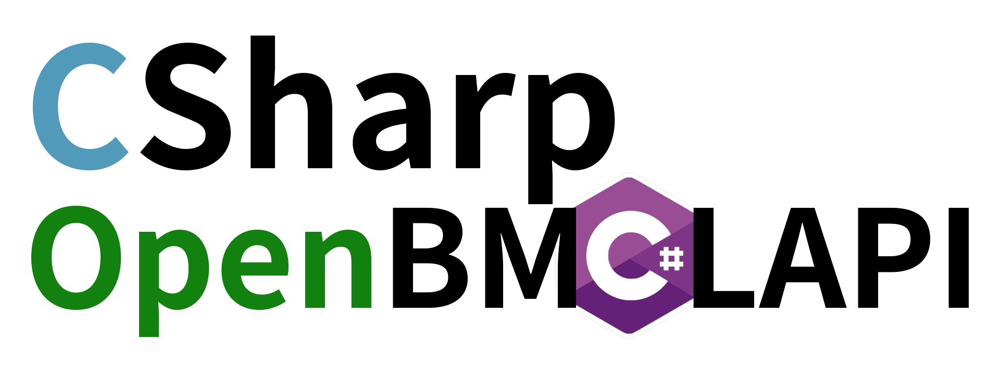



# CSharp-OpenBMCLAPI
🎉 [OpenBMCLAPI](https://github.com/bangbang93/openbmclapi) 的 C# 版本实现 🎉

  
  
  

> 注：本仓库的代码参照 [OpenBMCLAPI](https://github.com/bangbang93/openbmclapi) 的思路编写，部分特性、Bug 可能部分、甚至完全与 [OpenBMCLAPI](https://github.com/bangbang93/openbmclapi) 撞车。

> [!TIP]
> 由于作者学业繁忙，且~~懒得编译发布~~，所以 Release 构建会很不及时，有需要的人请自行构建源代码

# 项目说明

本项目是 [OpenBMCLAPI](https://github.com/bangbang93/openbmclapi) 的 C# 版本，OpenBMCLAPI 是通过分布式集群帮助 [BMCLAPI](https://bmclapidoc.bangbang93.com/) 进行文件分发、加速中国大陆 Minecraft 下载的公益项目。

如果你想加入 OpenBMCLAPI，可以在 [OpenBMCLAPI-Dashboard](https://bd.bangbang93.com) 申请集群节点以获取 `CLUSTER_ID` 和 `CLUSTER_SECRET`

# 使用

详见 [Wiki](https://github.com/SALTWOOD/CSharp-OpenBMCLAPI/wiki)